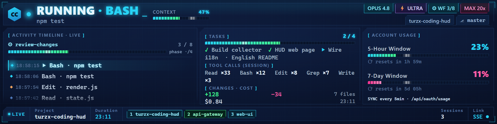
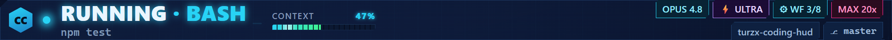
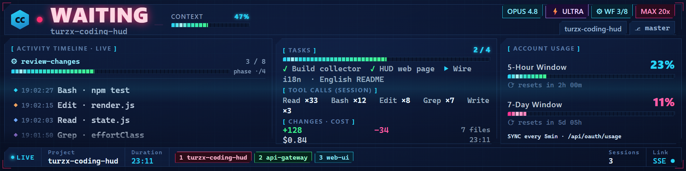

<div align="center">

# 🖥️ TURZX Coding HUD

**Turn a secondary display into a real-time coding dashboard for Claude Code**

**English** · [简体中文](README.zh-CN.md)



> An 8.8″ secondary screen (1920×480) showing, in real time, what Claude Code is doing, how far it has gotten, and how much quota is left.
> When a session enters "waiting for approval / idle reminder", the **whole screen lights up**—so you never miss the AI sitting there waiting on you.

</div>

---

## ✨ What is this

When coding with Claude Code, do you often:

- Switch to another window, then come back to find the AI has been **waiting for your approval** for ten minutes;
- Want to know **how far this run got**, how many tools it called, how many lines it changed, how much it cost—but have to dig through logs;
- Run **several Claude Code windows** at once and lose track of which is busy and which is waiting.

**TURZX Coding HUD** lays it all out on a secondary screen: display-only, read-only, never stealing input—a quiet "coding dashboard". One glance and you've got the full picture.

## 🎯 Features

- 🟢 **Live status** — `working` / `running` / `waiting` / `idle`, with the currently running tool at a glance
- 🔴 **Waiting alert** — the moment a session hits `waiting` (approval / idle), the HUD floods the whole screen red—impossible to miss
- 📊 **Multi-dimensional info** — context usage, task progress, tool-call stats, code changes, cost, duration
- ⚡ **ultracode / reasoning effort** — the current effort level (low→max) and ultracode mode, live
- ⚙️ **Workflow progress** — a real-time M/N progress bar for multi-agent workflows
- 🪟 **Multi-session tracking** — watch several Claude Code windows at once, auto-focusing the most recently active one
- 📈 **Account usage** — 5-hour / 7-day rolling-window usage + reset countdown
- 🛡️ **Zero intrusion** — any HUD failure **never affects** Claude Code itself (the top design principle)
- 🎨 **Sci-fi dashboard UI** — a neon dashboard style tailored for 1920×480 secondary screens

## 📸 Interface tour

### Overall layout

One screen, every zone—here's what each area shows:


- **Banner (top)** — live status (`RUNNING · BASH`), context gauge, and info chips (model, effort / ULTRA, workflow, plan, project, branch)
- **Activity timeline (left)** — the current tool plus a live feed of recent tool calls, with the workflow progress bar on top
- **Tasks / Tool calls / Changes (center)** — task checklist with completion, per-session tool-call counts, and code changes + cost + duration
- **Account usage (right)** — 5-hour / 7-day rolling-window usage with reset countdowns
- **Footer** — project, duration, and one labeled chip per tracked session (the focused one highlighted)

### Banner detail

Status, context, and info chips lined up across the top:



From left to right: **live status + current tool**, **context usage %**, then the info chips—**model**, **⚡ ULTRA / effort level**, **⚙ workflow M/N**, **subscription plan**, **project name**, and **⎇ git branch**.

### Waiting alert state

When a session enters `waiting` (approval / idle reminder), the `WAITING` text turns red, enlarges and blinks, with red corner borders and a red status dot—grabbing your attention instantly:



> This is a by-design alert for the `waiting` state, triggered by the `Notification` hook event (approval / idle reminder), and **unrelated to network disconnects**—a dropped connection only shows a single `SSE ○ reconnecting` line in the footer, never a full-screen alert.

## 🚀 Quick start

**Requirements**: Node.js 18+ (ESM runtime) · a secondary screen (ideally 1920×480, e.g. TURZX 8.8″; falls back to a window on the primary screen if none is detected) · **no npm dependencies, no build step**.

### Just run it (no install)

```bash
npm start                 # start the collector, listening on :4317
node tools/replay.js      # in another terminal, replay a sample event sequence
# open http://localhost:4317 in a browser to see the HUD
```

### Install into Claude Code (Windows)

```powershell
# inject hook / statusline and register auto-start on login
powershell -ExecutionPolicy Bypass -File scripts\install.ps1
# launch the collector and tile the HUD onto the secondary screen in kiosk mode
powershell -ExecutionPolicy Bypass -File scripts\start-hud.ps1
# restart Claude Code to take effect
```

Uninstall: `powershell -ExecutionPolicy Bypass -File scripts\uninstall.ps1` (restores `settings.json`, removes auto-start).
The port can be overridden via the `HUD_PORT` environment variable (default `4317`).

### Interface language (中文 / English)

The HUD supports both Chinese and English, defaulting to Chinese. Two ways to switch:

- **Quick look**: open `http://localhost:4317/?lang=en` (English) or `http://localhost:4317/` (Chinese) in a browser.
- **Kiosk default language**: set the `lang` field in `scripts/hud-config.json` (`"zh"` / `"en"`); `start-hud.ps1` builds the kiosk URL accordingly.

Unknown or missing languages fall back to Chinese. The text dictionary lives in `public/i18n.js`.

### Fitting other screen sizes

The HUD canvas is designed at 1920×480, but **auto-scales and centers** to fit your screen's actual resolution: the launcher opens the window at the detected screen size, and the page scales the canvas to fill it (preserving aspect ratio, never cropping). So **any secondary screen works out of the box**—screens matching the 1920×480 ratio fill edge to edge, others get symmetric letterbox bars.

- **Pick the right screen (multi-monitor)**: set `targetScreen` `width` / `height` in `scripts/hud-config.json` to your screen; `pickScreen` matches it exactly (falling back to the first non-primary screen otherwise).
- **Remove the bars / tune for your ratio** (advanced): change the `.hud{width/height}` canvas size in `public/hud.css` and adjust the three-column widths and font sizes accordingly—a layout reflow for a new aspect ratio that takes some CSS.

## 🏗️ Architecture

One-way data flow, three stages; the HUD is always the "read-only tail":

```
Claude Code sessions (1–3 in parallel)
  ├ Hooks      → curl POST /hook
  └ Statusline → POST /statusline
            │  (curl -m 1, exit 0 even on error — fails silently, never drags down Claude Code)
            ▼
  Collector src/server.js (resident on :4317)
   · keeps session state in memory, derives status, accumulates tool counts / timeline
   · polls account usage, read-only polling of workflow progress
            │  pushes full snapshots over SSE (GET /events)
            ▼
  HUD web page public/ (1920×480 single page, repaints on each snapshot)
```

- **Collector** `src/` — pure-function state reducer (`state.js`) + HTTP/SSE service (`server.js`)
- **HUD web page** `public/` — pure scalar formatting (`format.js`) / pure HTML fragment generation (`render.js`) + a thin glue layer (`hud.js`)
- **Tests** — Node's built-in `node:test`, no framework, no dependencies; `npm test` runs 100+ cases all green

## 🛡️ First design principle

> **No HUD component failure—service down, screen unplugged, network issue—may ever affect Claude Code itself. This constraint outranks every feature.**

The hook / statusline forwarders use `curl -m 1` and `exit 0` even on error; timeouts and failures are all silent. If the collector, the screen, or the network fails, Claude Code keeps running and you won't even notice.

## ⚠️ Known limitations

- `contextPct` / `filesChanged` are not yet populated (always show `0`); planned for later. The HUD renders the contract faithfully.
- The installer / launcher are currently Windows PowerShell; the collector and the HUD web page themselves are cross-platform.

## 📄 License

MIT

---

<div align="center">
Made with ❤️ for Claude Code · <a href="README.zh-CN.md">简体中文</a>
</div>
