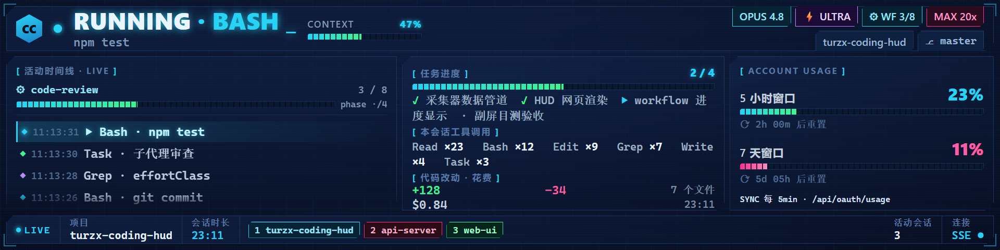
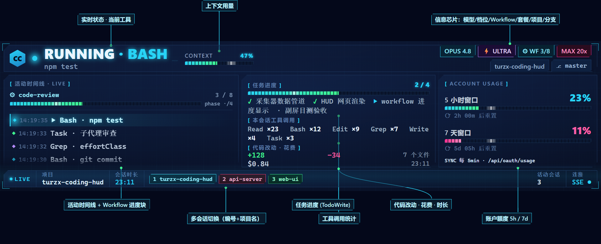
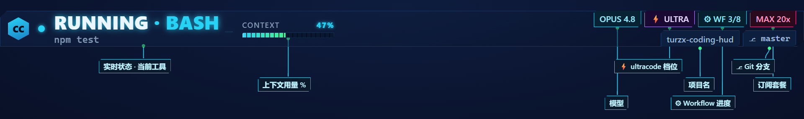
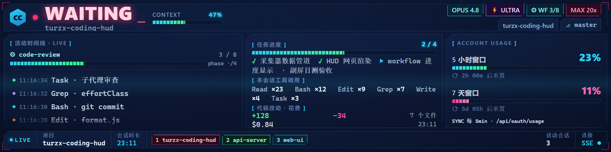

<div align="center">

# 🖥️ TURZX Coding HUD

**把副屏变成 Claude Code 的实时编程仪表盘**

[English](README.md) · **简体中文**



> 一块 8.8″ 副屏（1920×480），实时显示 Claude Code 正在做什么、跑到哪一步、还剩多少额度。
> 会话进入「等待授权 / 空闲提醒」时**整屏强高亮**——再也不怕 AI 卡在那儿等你，半天没发现。

</div>

---

## ✨ 这是什么

用 Claude Code 写代码时，你是不是经常：

- 切到别的窗口干活，回头发现 AI 早就**卡在等你授权**了，白等十分钟；
- 想知道**这次跑到哪了**、调了多少工具、改了多少行、花了多少钱，却要翻半天日志；
- 同时开**好几个 Claude Code 窗口**，记不清哪个在忙、哪个在等。

**TURZX Coding HUD** 把这些全摊在一块副屏上：纯展示、只读、不抢输入，安安静静当你的「编程仪表盘」。瞄一眼副屏，状态尽收眼底。

## 🎯 核心特性

- 🟢 **实时状态** — `working` / `running` / `waiting` / `idle`，当前正在跑的工具一目了然
- 🔴 **等待强提醒** — 一进 `waiting`（等授权 / 空闲），HUD 整屏红色强高亮，绝不漏掉
- 📊 **多维信息** — 上下文用量、任务进度、工具调用统计、代码改动、花费、时长
- ⚡ **ultracode / 推理档位** — 当次 effort 等级（low→max）与 ultracode 模式实时显示
- ⚙️ **Workflow 进度** — 多 Agent workflow 的实时 M/N 进度条
- 🪟 **多会话跟踪** — 同时盯多个 Claude Code 窗口，自动聚焦最新活跃的那个
- 📈 **账户额度** — 5 小时 / 7 天滚动窗口用量 + 重置倒计时
- 🛡️ **零侵入** — HUD 任何组件故障都**绝不影响** Claude Code 本身（最高设计原则）
- 🎨 **科幻仪表盘 UI** — 专为 1920×480 副屏定制的霓虹仪表盘风格

## 📸 界面导览

### 整体布局

一屏看懂所有功能区：



### 顶栏（Banner）细节

状态、上下文、信息芯片区一字排开：



### 等待强提醒态

会话进入 `waiting`（等待授权 / 空闲提醒）时，`WAITING` 红字放大闪烁 + 四角红边框 + 红色状态点，一眼抓住你的注意力：



> 这是 `waiting` 态的设计内强提醒，由 `Notification` hook 事件触发（等授权 / 空闲提醒），**与网络断连无关**——断线只在 footer 显示一行 `SSE ○ 重连中`，不会整屏告警。

## 🚀 快速开始

**环境要求**：Node.js 18+（运行时为 ESM）· 一块副屏（理想 1920×480，如 TURZX 8.8″；检测不到副屏会降级到主屏窗口）· **无需 npm 依赖、无构建步骤**。

### 先跑起来看（不安装）

```bash
npm start                 # 启动采集器，监听 :4317
node tools/replay.js      # 另开一个终端，回放示例事件序列
# 浏览器打开 http://localhost:4317 即可看到 HUD
```

### 安装到 Claude Code（Windows）

```powershell
# 注入 hook / statusline，并注册开机自启
powershell -ExecutionPolicy Bypass -File scripts\install.ps1
# 拉起采集器，并把 HUD 以 kiosk 模式铺到副屏
powershell -ExecutionPolicy Bypass -File scripts\start-hud.ps1
# 重启 Claude Code 生效
```

卸载：`powershell -ExecutionPolicy Bypass -File scripts\uninstall.ps1`（还原 `settings.json`、移除开机自启）。
端口可用环境变量 `HUD_PORT` 覆盖（默认 `4317`）。

## 🏗️ 架构

单向数据流，三段，HUD 永远是「只读末端」：

```
Claude Code 会话（1-3 个并行）
  ├ Hooks      → curl POST /hook
  └ Statusline → POST /statusline
            │  （curl -m 1，出错也 exit 0 —— 静默失败，绝不拖累 Claude Code）
            ▼
  采集器 src/server.js（常驻 :4317）
   · 内存维护会话状态、派生 status、累加工具计数 / 时间线
   · 轮询账户额度、只读轮询 workflow 进度
            │  SSE 推送全量快照（GET /events）
            ▼
  HUD 网页 public/（1920×480 单页，收到快照即重绘）
```

- **采集器** `src/` — 纯函数状态 reducer（`state.js`）+ HTTP/SSE 服务（`server.js`）
- **HUD 网页** `public/` — 纯标量格式化（`format.js`）/ 纯 HTML 片段生成（`render.js`）+ 薄胶水层（`hud.js`）
- **测试** — Node 内置 `node:test`，无框架、无依赖，`npm test` 100+ 用例全绿

## 🛡️ 设计第一原则

> **HUD 任何组件故障——服务没起、副屏没接、网络问题——绝不能影响 Claude Code 本身的运行。这条约束高于一切功能需求。**

hook / statusline 转发器用 `curl -m 1` + 出错也 `exit 0`，超时与失败全部静默；采集器、副屏、网络任意一环挂掉，Claude Code 照常运行，你甚至不会察觉。

## ⚠️ 已知限制

- `contextPct` / `filesChanged` 暂未填充（恒显 `0`），为后续计划项；HUD 照契约忠实渲染。
- 安装器 / 启动器目前为 Windows PowerShell；采集器与 HUD 网页本身跨平台。

## 📄 License

MIT

---

<div align="center">
用 ❤️ 为 Claude Code 打造 · <a href="README.md">English</a>
</div>
